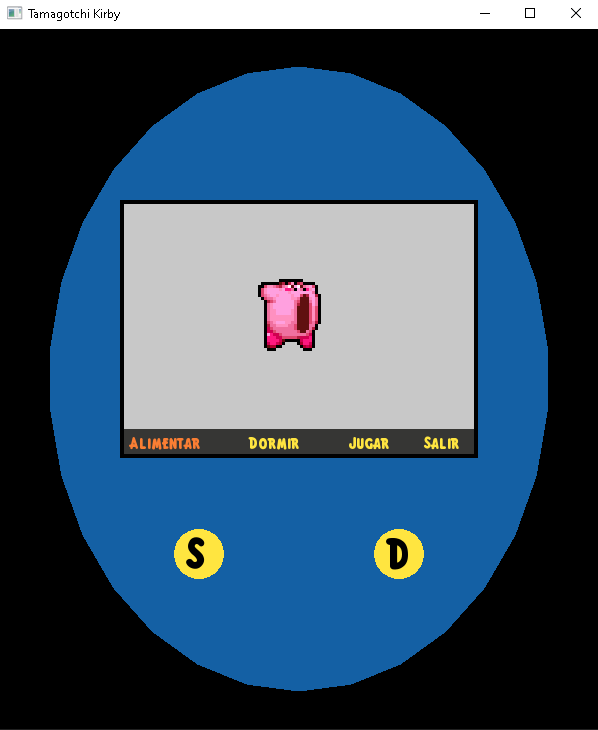
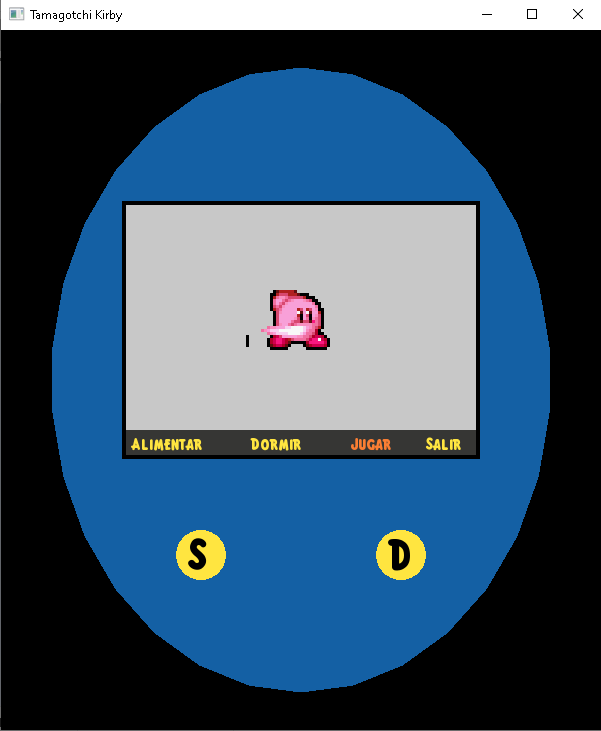

# Tamagotchi chill
## Descripción
Juego tipo **Tamagotchi**, en el que hay 3 actividades disponibles a realizar con el carismático personaje por defecto, donde se interactua por medio de 2 teclas para desplazarse en un menú principal.
## Manual
1. Ejecutar el programa
2. Apariencia:
    * Forma de Tamagotchi que cuenta con una pantalla y 2 botones (S y D), diferenciados entre si por su inicial, en la pantalla se muestra al personaje, y al menú principal en la parte inferior de la misma.
3. Menú:
    * **Alimentar:** Esta opcion nos da la oportunidad de intentar **hacer engordar** al personaje (lo que es imposible), pero lo intentamos.
    * **Dormir:** Esta opcion nos permite darle un **sape** amablemente al personaje para mandarlo a dormir
    * **Jugar:** Esta opcion muestra al personaje luciendo sus **habilidades deportivas**
    * **Salir:** Esta es la opcion para **adormecer al personaje** lo suficiente para cerrar el programa y retirarnos.

## Información Autores
### Nombres y Registros
* Elías Uriel Torres Hernández
    * 23310395
* Christian González Zárate
    * 23310384
### Grado y Grupo
* 3E
### Licenciatura
* Ingeniería Mecatrónica
### Profesor
* José Ramón Navarro Márquez

## Acerca de:

[Repositorio de **Github**](https://github.com/CGZarate2/Tamagotchi.git)

## Capturas de funcionamiento

